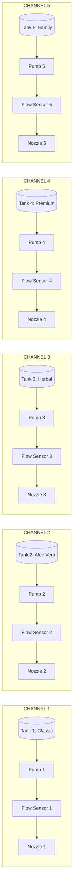

# AQUORA System Architecture & Schematics Diagrams

## High-Level Distributed Architecture
```mermaid
graph TD
    subgraph SYSTEM 1: PAYMENT TERMINAL (AQ-PT-001)
        UI[Elecrow 7.0 Inch 800x480 HMI]
        ESP32S3[ESP32-S3 Core Controller]
        TOUCH[GT911 Capacitive Touch]
        PRINTER[ESC/POS Thermal Receipt Printer]
        UI --- ESP32S3
        TOUCH --- ESP32S3
        PRINTER --- ESP32S3
    end

    subgraph CLOUD / SERVER INFRASTRUCTURE
        GW[Razorpay / UPI Payment Gateway]
        BACKEND[Aquora Authoritative Backend]
        DB[(Supabase PostgreSQL Database)]
        WS[Realtime WebSocket Engine]
        GW -->|POST Webhook with HMAC| BACKEND
        BACKEND <--> DB
        BACKEND <--> WS
    end

    subgraph SYSTEM 2: SANITIZER DISPENSING MACHINE (AQ-DM-001)
        ESP32[ESP32 Safety Controller]
        ESTOP[Hardware E-Stop Push Button]
        MOSFETS[5x N-Channel Logic MOSFETs]
        PUMPS[5x 12V DC Dispensing Pumps]
        FLOWSENSORS[5x Turbine Flow Sensors]
        NOZZLES[5x Anti-Drip Spray Nozzles]

        ESP32 -->|Interlock Gating| MOSFETS
        MOSFETS --> PUMPS
        PUMPS --> FLOWSENSORS
        FLOWSENSORS -->|Pulse Counting ISR| ESP32
        FLOWSENSORS --> NOZZLES
        ESTOP -->|Hardware Cut & Signal| ESP32
    end

    ESP32S3 -->|1. Create Order & Fetch QR| BACKEND
    WS -->|3. Live Sensor Progress| ESP32S3
    BACKEND -->|2. Authorize Signed Job| ESP32
    ESP32 -->|4. Completion Telemetry| BACKEND
```

## Physical Fluid Channel Schematic (Section 27)

